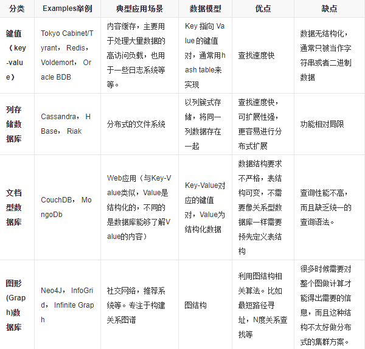

# NoSQL

NoSQL == Not only SQL (不仅仅是SQL)

泛指非关系型数据库，传统的关系型数据库很难应付web2.0时代，尤其是超大规模的高并发的社区，暴露出很多难以解决的问题，NoSQL在当今大数据环境下发展的十分迅速。

## 特点

1. 方便扩展（数据之间没有关系，耦合性低）
2. 大数据量高并发（Redis 1秒写8万次，读取11万，NoSQL的缓存记录级，是一种细粒度的缓存）
3. 数据类型多样（不需要事前设计数据库，随取随用）

## RDBMS和NoSQL

**RDBMS**

- 结构化组织
- SQL
- 数据和关系都存在单独的表中
- 数据操作，数据定义
- 严格的一致性
- 基础的事务
- ...

**NoSQL**

- 不仅仅是数据
- 没有固定的查询语言
- 键值对存储，列存储，稳定存储，图像数据库
- 最终一致性
- CAP定义和BASE理论
- 高性能，高可用，高可扩
- ...

## 分类

**KV键值对**：

- 新浪：Redis
- 美团：Redis + Tair
- 阿里，百度：Redis + memecache

**文档型数据库（bson）：**

- MongoDB
- ConthDB

**列存储数据库**

- HBase
- 分布式文件系统

**图关系数据库**

- Neo4j
- InfoGrid

