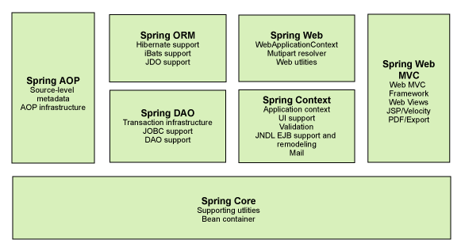

# 1.Spring

## 简介

- 2002，首次推出Spring框架的雏形：interface21
- 理念：是现有的技术更加任意使用，本身是一个大杂烩，整合了现有的技术框架
- SSH：Struct2 + Spring + Hibernate
- SSM：SpringMVC + Spring + Mybatis

```xml
<!-- https://mvnrepository.com/artifact/org.springframework/spring-webmvc -->
<dependency>
    <groupId>org.springframework</groupId>
    <artifactId>spring-webmvc</artifactId>
    <version>5.3.0</version>
</dependency>
<!-- https://mvnrepository.com/artifact/org.springframework/spring-jdbc -->
<dependency>
    <groupId>org.springframework</groupId>
    <artifactId>spring-jdbc</artifactId>
    <version>5.3.0</version>
</dependency>
```

## 优点

- Spring是一个开源的免费的框架
- 是一个轻量级的，非入侵式的框架
- 控制反转（IOC），面向切面编程（AOP）
- 支持事务的处理，对框架整合的支持

**总结：Spring就是一个轻量级的控制反转（IOC）和面向切面编程（AOP）的框架**

## 组成



## 扩展

- Spring Boot
	- 一个快速开发的脚手架
	- 基于SpringBoot可以快速开发的开发单个微服务
- Spring Cloud
	- Spring Cloud 是基于Spring Boot实现的

因为现在大多数公司都在SpringBoot进行快速开发，学习SpringBoot的前提，需要完全掌握Spring及SpringMVC，承上启下的作用

**弊端：发展了太久之后，违背了原来的理念，配置十分繁琐，人称："配置地狱"**

# 2.IOC理论推导

1. UserDao  接口
2. UserDaoImpl  实现类
3. UserService  业务接口
4. UserServiceImpl 业务实现类

在我们之前的业务中，用户的需求可能会影响我们的原来的代码，我们需要根据用户的需求去修改原代码，如果程序代码量十分大，修改一次的成本代价十分昂贵

我们使用一个Set接口实现.已经发生了革命性的变化

```java
private UserDao userDao;

//利用set实现值的注入
public void setUserDao(UserDao userDao){
    this.userDao = userDao;
}
```

- 之前，程序是主动创建对象，控制权在程序员手上
- 使用了set注入后，程序不再具有了主动性。而是变成了被动的接受对象

这种思想，从本质山解决了问题，程序员不用再去管理对象的创建了，系统的耦合性大大降低，可以更加专注的在业务的实现上，这是IOC的原型

## IOC本质

**控制反转IoC是一种设计思想，DI（依赖注入）是实现IoC的一种方法**

**控制反转是一种通过描述（XML或注解）并通过第三方去生产或获取特定对象的方式，在Spring中实现控制反转的是IoC容器，其实现方法是依赖注入**

# 3.HelloSpring

1. 编写Hello实体类

	```java
	package com.venns.pojo;
	
	public class Hello {
	    private String str;
	
	    public void setStr(String str) {
	        this.str = str;
	    }
	
	    public String getStr() {
	        return str;
	    }
	
	    @Override
	    public String toString() {
	        return "Hello{" +
	                "str='" + str + '\'' +
	                '}';
	    }
	}
	```

2. 编写我们的spring文件

	```xml
	<?xml version="1.0" encoding="UTF-8"?>
	<beans xmlns="http://www.springframework.org/schema/beans"
	       xmlns:xsi="http://www.w3.org/2001/XMLSchema-instance"
	       xsi:schemaLocation="http://www.springframework.org/schema/beans
	        https://www.springframework.org/schema/beans/spring-beans.xsd">
	
	    <!--
	        使用Spring来创建对象，在Spring中这些都成为Bean
	        类型 变量名 = new 类型();
	        Hello hello = new Hello();
	
	        id = 变量名
	        class = new 的对象
	        property 相当于给对象中的属性设置一个值
	    -->
	    <bean id="hello" class="com.venns.pojo.Hello">
	        <property name="str" value="Spring"/>
	    </bean>
	</beans>
	```

3. 测试

	```java
	import com.venns.pojo.Hello;
	import org.springframework.context.support.ClassPathXmlApplicationContext;
	
	public class MyTest {
	    public static void main(String[] args) {
	        //获取Spring的上下文对象
	        ClassPathXmlApplicationContext context = new ClassPathXmlApplicationContext("beans.xml");
	        //我们的对象现在都在Spring中管理了，我们要使用，直接去里面取出来就可以了
	        Hello hello = (Hello) context.getBean("hello");
	        System.out.println(hello.toString());
	
	    }
	}
	```

思考:

- Hello 对象是谁创建的 ?  【hello 对象是由Spring创建的】
- Hello 对象的属性是怎么设置的 ? 【 hello 对象的属性是由Spring容器设置的】

这个过程就叫控制反转 :

- 控制 : 谁来控制对象的创建 , 传统应用程序的对象是由程序本身控制创建的 , 使用Spring后 , 对象是由Spring来创建的
- 反转 : 程序本身不创建对象 , 而变成被动的接收对象 .

**现在，要实现不同的操作，只需要在xml配置文件中进行修改，所谓的IoC，就是：对象由Spring来创建，管理，装配**

# 4.IoC创建对象的方式

1. 使用无参构造创建对象【默认】

2. 使用有参构造创建对象

	1. 下标赋值

		```xml
		<!--第一种：下标赋值-->
		<bean id="user" class="com.venns.pojo.User">
		    <constructor-arg index="0" value="venns" />
		</bean>
		```

	2. 类型赋值

		```xml
		<!--第二种：类型赋值-->
		<bean id="user" class="com.venns.pojo.User">
		    <constructor-arg type="java.lang.String" value="venns" />
		</bean>
		```

	3. 参数名

		```xml
		<!--第三种：直接通过参数名-->
		<bean id="user" class="com.venns.pojo.User">
		    <constructor-arg name="name" value="venns" />
		</bean>
		```

总结：在配置文件加载的时候，容器中管理的对象就已经初始化了

# 5.Spring配置

## 别名

```xml
<!--别名，如果添加了别名，我们也可以使用别名获取到这个对象-->
<alias name="user" alias="userNew" />
```

## Bean的配置

```xml
<bean id="user" class="com.venns.pojo.User">
    <constructor-arg name="name" value="venns" />
</bean>
<!--别名，如果添加了别名，我们也可以使用别名获取到这个对象-->
<alias name="user" alias="userNew" />
<!--
    id：bean的唯一标识符，也就是相当于我们学的对象名
    class：bean对象所对应的全限定名：包名+类名
    name：也是别名，更加高级，可以同时去多个别名
-->
```

## import

一般用于团队开发使用，可以将多个配置文件导入合并为一个

假设现在项目中有多个人开发，分别负责不同的类开发，不同的类需要注册在不同的bean中，我们可以利用import将所有的beans.xml合并为一个总的，使用的时候直接使用总的配置就可以了

```xml
<import resource="beans.xml"/>
<import resource="beans2.xml"/>
<import resource="beans3.xml" />
```

# 6.DI依赖注入

## 构造器注入

即使用构造器创建对象

## Set方式注入【重点】

- 依赖注入：Set注入
	- 依赖：bean对象的创建依赖于容器
	- 注入：bean对象中的所有属性，由容器来注入

【环境搭建】

1. 复杂类型

	```java
	public class Address {
	    private String address;
	
	    public String getAddress() {
	        return address;
	    }
	
	    public void setAddress(String address) {
	        this.address = address;
	    }
	}
	```

2. 真实测试对象

	```java
	public class Student {
	    private String name;
	    private Address address;
	    private String[] books;
	    private List<String> hobbys;
	    private Map<String,String> card;
	    private Set<String> games;
	    private String wife;
	    private Properties info;
	}
	```

3. beans.xml

	```xml
	<?xml version="1.0" encoding="UTF-8"?>
	<beans xmlns="http://www.springframework.org/schema/beans"
	       xmlns:xsi="http://www.w3.org/2001/XMLSchema-instance"
	       xsi:schemaLocation="http://www.springframework.org/schema/beans http://www.springframework.org/schema/beans/spring-beans.xsd">
	
	    <bean id="student" class="com.venns.pojo.Student">
	        <!--普通注入：value-->
	        <property name="name" value="venns" />
	    </bean>
	</beans>
	```

4. 测试类

	```java
	public class MyTest {
	    public static void main(String[] args) {
	        ApplicationContext context = new ClassPathXmlApplicationContext("beans.xml");
	        Student student = (Student) context.getBean("student");
	        System.out.println(student.getName());
	    }
	}
	```

完善注册信息

```xml
<bean id="address" class="com.venns.pojo.Address">
    <property name="address" value="成都" />
</bean>
<bean id="student" class="com.venns.pojo.Student">
    <!--普通注入:value-->
    <property name="name" value="venns" />

    <!--Bean注入:ref-->
    <property name="address" ref="address" />

    <!--数组-->
    <property name="books">
        <array>
            <value>三国演义</value>
            <value>水浒传</value>
            <value>红楼梦</value>
            <value>西游记</value>
        </array>
    </property>

    <!--list-->
    <property name="hobbys">
        <list>
            <value>看电影</value>
            <value>敲代码</value>
            <value>听歌</value>
        </list>
    </property>

    <!--map-->
    <property name="card">
        <map>
            <entry key="身份证" value="12345678" />
            <entry key="银行卡" value="11111111" />
            <entry key="学生证" value="12332112" />
        </map>
    </property>

    <!--set-->
    <property name="games">
        <set>
            <value>LOL</value>
            <value>COC</value>
            <value>PUBG</value>
        </set>
    </property>

    <!--null-->
    <property name="wife">
        <null />
    </property>

    <!--property-->
    <property name="info">
        <props>
            <prop key="学号">20200101</prop>
            <prop key="性别">男</prop>
        </props>
    </property>
</bean>
```

## 拓展方式

